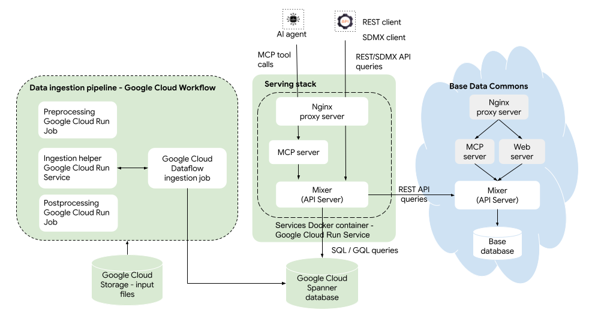

# Data Commons Platform User Guide

[TOC]

## About Data Commons Platform {#architecture}

The following diagram shows the architecture of Data Commons Platform.



Data Commons Platform consists of the following Google Cloud Platform services:

* [Cloud Storage](https://cloud.google.com/storage) – file storage system for storing your input data
* [Spanner](https://cloud.google.com/spanner) – database system for storing output data used for serving
* [Workflows](https://cloud.google.com/workflows) – workflow orchestration system that manages the data ingestion process from Cloud Storage and Cloud Spanner end to end
* [Dataflow](https://cloud.google.com/products/dataflow) – data processing pipeline that transforms the input data into output data
* [Cloud Run](https://cloud.google.com/run) – application hosting for additional Data Commons transformation logic and web serving components
* (Optional) [Memorystore for Redis](https://docs.cloud.google.com/memorystore/docs/redis) – data caching engine to boost query performance

## What's new in Data Commons Platform

The following section describes how the Platform differs from Custom Data Commons.

### Infrastructure

* All data and embeddings are stored in Cloud Spanner. 
* All data is stored in tables, with a graph view for nodes and edges, that is queryable with GQL.
* Data transformation from input files is performed by Cloud Dataflow and several custom components in a Cloud Run Service, all orchestrated by Cloud Workflow. 
* The Mixer now defaults to "stale reads" (the previous version of data) when it first starts up, so there is no downtime during Mixer restarts. 
* Input data files can be configured as separate imports. 
* Data can be rebuilt on a per-import basis, instead of rebuilding all data. 
* There is no NL Server.
* There is no web server or `website` repo.

### Workflow

* A new `datacommons` command-line tool provides a single interface for performing various cloud actions.
* New Terraform scripts and modules are in a separate Github repository (datacommons/infra/dcp), with no need to clone the repo.
* You specify the data files you want to import when you run the ingestion workflow.
* Service restarts are automatically triggered when new data is sent (no need to manually restart the services container for data changes).
* Although you can run a local service container and connect to a remote Spanner database, you cannot (currently) run the data ingestion pipeline locally.

### Schema

* Observations can contain up to 3 entities/places. 
* Data sources and provenances are defined in MCF (not `config.json`).
* `config.json` has several new configuration fields.
* CSV column headings must be mapped to DCIDs (no built-in default names).

### APIs

* Basic [SDMX](https://sdmx.org/) read APIs are available: Availability and Data
* REST and Python V2 APIs support filtering and chaining on any property and arc direction, and resolution on any entity type

### MCP

* New tools for getting metadata, searching child indicators, getting child observations, and getting multi-entity observations

## What's not changing

* CSV and MCF input file formats are still supported.
* Configuration is still provided in the `config.json` file.


## Install Data Commons Platform

Installing Data Commons Platform creates a completely new deployment in Google Cloud Platform. It has no effect on existing Custom Data Commons deployments.

Terraform manages the deployment of all GCP service accounts, resources, and secrets. 

### Prerequisites

* You must have a [GCP](https://cloud.google.com/docs/get-started) billing account and project, with the [Service Usage API enabled](https://docs.cloud.google.com/service-usage/docs/set-up-development-environment).
* You must have a Data Commons API key. If you haven't obtained one yet, go to [https://apikeys.datacommons.org](https://apikeys.datacommons.org/) and request a key for the `api.datacommons.org` domain.
* Install [gcloud CLI](https://cloud.google.com/sdk/docs/install-sdk) on your local machine. 
* Install [Terraform](https://developer.hashicorp.com/terraform/install?product_intent=terraform) on your local machine. Terraform is used to automate the setup steps of all the components.
* Install [uv](https://docs.astral.sh/uv/getting-started/installation/) on your local machine. uv is used to manage Python packages and is recommended for running the Data Commons CLI.  

### Permission roles

To install Data Commons, you must have the IAM Admin or (legacy) Owner role on your GCP project, or all of the following:

* [Service Usage Admin](https://docs.cloud.google.com/iam/docs/roles-permissions/serviceusage)  – to enable Cloud APIs
* [Service Account Admin](https://docs.cloud.google.com/iam/docs/service-accounts-create) – to create service accounts
* [Project IAM Admin](https://docs.cloud.google.com/resource-manager/docs/access-control-proj) – to create bindings between service accounts and resources
* [API Keys Admin](https://docs.cloud.google.com/iam/docs/roles-permissions/serviceusage#serviceusage.apiKeysAdmin) - to create and manage the Maps API key
* [Storage Admin](https://docs.cloud.google.com/storage/docs/access-control/iam-roles) – to create Cloud Storage buckets and folders
* [Spanner Admin](https://docs.cloud.google.com/iam/docs/roles-permissions/spanner)  – to create Cloud Spanner instances and databases
* [BigQuery Connection Admin](https://docs.cloud.google.com/iam/docs/roles-permissions/bigquery) – to create a BigQuery connection to Spanner, for federated queries
* [Workflow Admin](https://docs.cloud.google.com/iam/docs/roles-permissions/workflows) – to create Cloud Workflows
* [Run Admin](https://docs.cloud.google.com/iam/docs/roles-permissions/run) – to create[ Cloud Run services and jobs](https://docs.cloud.google.com/iam/docs/roles-permissions/secretmanager)
* [Secret Manager Admin](https://docs.cloud.google.com/iam/docs/roles-permissions/secretmanager) – to create and manage secrets
* (Optional) [Memory Redis Admin](https://docs.cloud.google.com/iam/docs/roles-permissions/redis) – to create a Memorystore for Redis instance + [Serverless VPC Access Admin](https://docs.cloud.google.com/iam/docs/roles-permissions/vpcaccess) – to create a [virtual private connection](https://docs.cloud.google.com/vpc/docs/serverless-vpc-access) to send traffic between Cloud Run services and Memorystore

### Step 1: Authenticate to Google Cloud Platform {#step1}

1. Authenticate yourself to GCP: From any directory, run `gcloud auth login` and follow the prompts to continue.
1. Authenticate Terraform and the Data Commons CLI to GCP: From any directory run `gcloud auth application-default login` and follow the prompts to continue.

### Step 2: Create your Terraform environment

You use the `datacommons` CLI to download Terraform scripts and provide required settings. 

This step does the following:

* Creates a subdirectory to store Terraform modules and scripts
* Creates a basic `terraform.tfvars` configuration file in the subdirectory
* By default, stores Terraform state files remotely, in a Google Cloud Storage bucket. You can provide an existing bucket in the same project that you are using for Terraform state files, or create a new one.  You can disable remote state management, in which case state files are saved locally. However, to ensure that state is maintained correctly across multiple administrators, we _strongly_ recommend that you keep the default option.

1. From any project directory where you will store and run Terraform script, run the following command:

    <pre>
    uvx datacommons-cli admin init \ 
    --project-id "<var>YOUR_GOOGLE_CLOUD_PROJECT_ID</var>" \
    --instance-name "<var>INSTANCE_NAME</var>" \
    --dc-api-key "<var>YOUR_DATA_COMMONS_API_KEY</var>" \
    [--no-tf-remote-state] | [--tf-state-bucket "<var>BUCKET_NAME</var>"] \
    [--tf-state-bucket-location "<var>REGION</var>" ]
    </pre>
    * _`INSTANCE_NAME`_ should be a meaningful name that will be used as a prefix for various resource names. If you intend to set up multiple deployments (e.g. "staging", "production", etc.), it's a good idea to include the environment in the name.

        > **WARNING:** You _must_ provide a name that is different from any Terraform namespaces you have used previously, to avoid destroying or corrupting existing components.

    * To reuse an existing bucket, or to create a new bucket with a specified name, provide a bucket name with `–-tf-state-bucket`. If you omit this flag, the tool creates a new bucket using the format <code><var>INSTANCE_NAME</var>-datacommons-data-<var>PROJECT_ID</var></code>.
    * If you are creating a new bucket, by default it is created in the `US` location, which is a [multi-region zone](https://docs.cloud.google.com/storage/docs/locations#location-dr). To specify an alternate location, use `--tf-state-bucket-location`. (See [Bucket locations | Cloud Storage](https://docs.cloud.google.com/storage/docs/locations) for supported locations.)

    A new subdirectory is created named according to your instance name, and a basic `terraform.tfvars` file is created with required variables set. 

2. Check the defaults set in the following files:

    <pre>
    cd <var>INSTANCE_NAME</var>
    cat terraform.tfvars
    cat variables.tf</pre>

If you're happy with the settings as they are, you can skip ahead to step 4. More likely, you will want to change some of the default settings in step 3 before proceeding.

### Step 3: Set/edit optional Terraform variables

The `terraform.tfvars` file you generated in the previous step provides optional but frequently configured variables, with overrides of default values set in `variables.tf`. Commented-out variables are the same as the defaults; to change them, uncomment the line you want and set the variable accordingly.

In addition, all of the deployment options you can configure are listed in `variables.tf`. To customize any of these options, _do not_ edit in place in `variables.tf`. Instead, add the variable(s) you want to override to the `terraform.tfvars` file and set it to the desired value. For example, if you wanted to disable the MCP server from running as part of the web services, you would add this line to `terraform.tfvars`:

```
datacommons_services_enable_mcp = false
```

Here are some variables you may wish to modify:

| **Option** | **Default** | **Description** |
| :----------|:------------|:----------------|
| `region` | `us-central1`, close to the base Data Commons deployment | The data center locations where your Data Commons resources are provisioned. If you want to set this to a different value, for a list of supported regions, see [Geography and regions](https://docs.cloud.google.com/docs/geography-and-region). |
| `storage_create_artifacts_bucket` | `true` | Create a new Cloud Storage bucket to store your CSV, MCF and `config.json` files.<br/>If you already have a bucket in the same project that you want to reuse, set this to `false` and provide the name of your bucket using `storage_artifacts_bucket_name`.<br/>**Note:** We do not recommend reusing a bucket in which you have previously stored Data Commons data.This risks unintended data corruption or deletion. | 
| `ingestion_input_path` | `ingestion/input` | The Cloud Storage folder where you will store your input files (MCF, CSV, `config.json`). |
| `spanner_create_instance` | `true` | Creates a new Cloud Spanner instance. If you want to reduce costs, and already have a Spanner instance that you want to reuse, set this to `false` and provide the name of the instance using `spanner_instance_id`.<br/>**Note:** If you are creating multiple deployments, e.g. dev and prod, we recommend that you reuse a single instance (but not a database): set this to `false` for all other deployments. |
| `spanner_create_bigquery_reservation` | `true` | Data Commons uses [BigQuery federated queries](https://docs.cloud.google.com/bigquery/docs/federated-queries-intro) internally to write data to Spanner. The first time you create a deployment in a given region, set this to `true` to create a BigQuery capacity reservation.<br/>**Important!** The reservation must only be created *once*, for the first deployment instance.There can only be one reservation per project per region. If another is created in the same deployment or other deployments in the same project/region, the ingestion pipeline will fail. On the other hand, if you set the variable to `false` after creation, Terraform will destroy it and break other deployments. The solution is to remove the resource from Terraform tracking in the first deployment; please see [Handle resource creation special variables](#handle) for procedures. |
| `enable_redis` | `false` | Google Cloud [Memorystore for Redis](https://docs.cloud.google.com/memorystore/docs/redis/memorystore-for-redis-overview) is a caching service that speeds up website and API performance. We recommend keeping it disabled during development. When you launch to production, depending on your traffic load, you may wish to enable it. | 
| `stateful_deletion_protection`  | `false` | Determines whether you will be allowed to destroy your "stateful" resources which are Spanner, and the artifacts GCS bucket. We recommend setting this to `true` for production. | 
| `stateless_deletion_protection` |  `false` | Determines whether you will be allowed to `destroy` your "stateless" resources which are the resources that can be re-spun up with no data loss (Cloud Run Services and Jobs, Redis, Workflows). We recommend setting this to true for production. | 
| `spanner_version_retention_period` | `24h` | The Spanner database is configured to retain data for this period. Within this time frame, all mutations are kept and there is the ability to do point-in-time-restore.<br/>It also provides the ability to query Spanner at any timestamp within the time frame.This means that data can be queried even during ingestion of large imports, without the risk of serving from a corrupted database while data is being modified.<br/>In case of failures mid-ingestion, you have the time of this retention period to resolve it before your requests start to serve data on  a potentially corrupted database. (See [Restore database from backup](#restore) for details.)<br/>You can increase the value up to 7 days, but it does incur additional cost. To learn more, see [Point-in-time recovery (PITR) overview](https://docs.cloud.google.com/spanner/docs/pitr). |

### Step 4: Run the Terraform deployment

This step does the following:

* Creates various [service accounts](https://docs.cloud.google.com/iam/docs/service-account-overview) for your project and instance name and assigns them various permissions ([IAM roles](https://docs.cloud.google.com/iam/docs/roles-overview))
* Enables all necessary APIs. (For the full list of APIs enabled, see the `main.tf` file in your Terraform directory.)
* Provisions and deploys all the infrastructure components listed in the [architecture section](#architecture) above
* Stores all secrets (API keys and database passwords) in the [Cloud Secret Manager](https://cloud.google.com/secret-manager/docs/overview).
* Creates a URL for accessing your service in the browser

1. From the directory where your Terraform configuration is stored, run the following command one time:
    ```shell
    terraform init
    ```
1. Run the following command to validate your configuration:
    ```shell
    terraform plan
    ```
1. Review the plan and make any changes if needed.
1. When you are ready to deploy, run the following:
    ```shell
    terraform apply
    ```
1. At the prompt asking you to confirm the actions before creating resources, type `yes` to proceed. The first time, it will take about 15 minutes to complete. 
1. Take note of the names of the various accounts and services created. 

> **Tip:** To retrieve the values of the most commonly used variables (the ones provided in `outputs.tf`), or a specific variable, you can run:
<pre>
terraform output [<var>VARIABLE_NAME</var>]
</pre>
For example, to get the live value of the variable `datacommons_services_name`, you can run:

```shell
terraform output datacommons_service_name
```

To retrieve the full state of all resources and output variables, use the following command:

```shell
terraform show
```

### Step 5: Grant IAM permissions to impersonate service account

To set up the Spanner tables and run the data ingestion workflow, Terraform creates a project-wide [service account](https://docs.cloud.google.com/iam/docs/service-account-overview) with a restricted set of resource access permissions.

The service account name is <code><var>INSTANCE_NAME</var>-dc-ing-wf-sa@datcom-website-dev.iam.gserviceaccount.com</code>.

To run the datacommons CLI commands that execute these processes, you need to impersonate the service account using your own credentials. To do so, you create a one-time IAM binding that gives your account permission to act as the service account.

1. Ensure you have authenticated as in [step 1](#step1).
1. Optionally, from your Terraform directory, run the following to get the name of the service account:
   ```shell
   terraform output ingestion_workflow_service_account_email
   ```
1. Run the following command:
   <pre>
   gcloud iam service-accounts add-iam-policy-binding "<var>SERVICE_ACCOUNT</var>" \
    --member="user:<var>YOUR_USER_ACCOUNT</var>" \
    --role="roles/iam.serviceAccountTokenCreator" \
    --project="<var>PROJECT_ID</var>"</pre>
    Your user account is whatever email address you are using as a member of your GCP project.

To verify that your account has been added as a principal to the service account, you can look up the details as follows:

1. Go to <code>https://console.cloud.google.com/iam-admin/serviceaccounts?project=<var>PROJECT_ID</var></code>.
1. From the list of service accounts, click on the <code><var>INSTANCE_NAME</var>-dc-ing-wf</code> account and select **Principals with access**. You should see your user account in the list.

### Step 6: Create the Spanner schema and tables

From the directory where your Terraform configuration is stored, run the following command:

```
uvx datacommons-cli admin init-db
```

When it completes, verify that the tables are created correctly:

Go to <code>https://console.cloud.google.com/spanner/instances/<var>SPANNER</var>_<var>INSTANCE</var>/databases/<var>DATABASE</var>/details/tables?project=<var>PROJECT_ID</var></code>

* Your <code><var>SPANNER</var>_<var>INSTANCE</var></code> is set by the Terraform `spanner_instance_id` variable. If you didn't set this explicitly, the default is <code><var>INSTANCE_NAME</var>-dc-instance</code>. To look it up, from your Terraform directory, you can run:
  ```
    terraform output spanner_instance_id
  ```
* The _`DATABASE`_ is set by the Terraform `spanner_database_id` variable. If you didn't set this explicitly, the default is <code><var>INSTANCE_NAME</var>-dc-db.</code> To look it up, from your Terraform directory, you can run:

  ```
    terraform output spanner_database_id
  ```
  You should see a list of tables at the bottom of the page.

## Prepare your data {#prepare-your-data}

The following procedures assume that you are familiar with defining nodes in MCF, structuring CSV file data, and the structure of the config.json file. If not, please familiarize yourself with [Prepare your own data](https://docs.datacommons.org/custom_dc/custom_data.html) in the Custom Data Commons documentation before proceeding.

If you'd like to just start with some sample data, you can download the files from [https://github.com/datacommonsorg/datacommons/tree/main/samples/OECD_wage_data](https://github.com/datacommonsorg/datacommons/tree/main/samples/OECD_wage_data) and skip to [Import your data](#import-your-data).

### Step 1: Decide on a file and directory structure for your data

Data Commons Platform requires the following input:

* One or more MCF files that define your custom [provenances, sources](https://docs.datacommons.org/data_model.html#sources), entities, and statistical variables
* One or more CSV files that provide the statistical observations
* One or more config.json file(s) that define "imports"; that is, the subset of data you want to import when you run the ingestion workflow.

Data Commons Platform allows for per-*provenance* file imports. A provenance corresponds to one or more tables, i.e. CSV files. Rather than batch-ingesting *all* your input data files at the same time, you can specify which files are to be imported in a given workflow. When you run the ingestion workflow, you provide the name of a directory containing the data files you want to import. The directory can contain files from one or more provenances. It can also contain nested subdirectories. 

> **Note:** The ingestion workflow operates on a per-import basis. When the workflow runs, it wipes all data associated with the specified import from Spanner. This means that each time you ingest new data for a given import, you must reingest all the data for that import. You cannot do "incremental"-type imports, involving only new rows.

When you organize your files into directories, keep in mind the following:

* A single "import" is identified by a directory and a `config.json` file. Each directory constituting a separate import must have its own `config.json` file. You can, however, ingest multiple imports during a single workflow run.
* Multiple CSV files can belong to the same provenance.
* A `config.json` file (representing one import) can contain multiple provenances; but one provenance must not be present in multiple `config.json` files.
* If you want to version your import configurations, you can place old `config.json` / MCFs / CSVs under the “archives” subdirectory. 
* When you re-ingest an import, all the observations, timeseries and edges in the same provenance are destroyed and recreated. Therefore, once you have ingested an import, be sure to always include all the same files in the import for all future ingestions.

Let's look at a few illustrative examples representing possible import structures and patterns. The methods for configuring these structures are provided in [Step 6: Write your config.json file](#config).

> **Note:** In the following examples, `ingestion_base` is the equivalent of `ingestion/input` or a custom directory you specified in the` ingestion_input_path` Terraform variable. You will store your files in at least one subdirectory of this path.

#### Example 1: Single import, single provenance

A single import with a single provenance can have all CSV files in the same directory, or split up into several subdirectories. All files are ingested together as a self-contained import. 

```
ingestion_base /
  |- my_first_import /    
    |– config.json  <--- Single import
    |– schema.mcf
    |- data1.csv
    |– my_data_2/     
      |– data2.csv
    |– my_data_3/
      |– data3.mcf
    |- archives/   <--- completely ignored
      |- 2025/
         |- config.json 
```

#### Example 2: Single import, multiple provenances

If you have data files from multiple provenances, it's a good idea to keep them in separate directories. Here's an example of a single import consisting of 2 provenances. In this case, all files are ingested as a single import during a workflow run.

```
ingestion_base/
  |- my_first_import /   
    |– config.json      <--- Single import
    |- shared_schema.mcf  <--- Optional
    |– my_provenance_1/ <--- First provenance
        |– data1.csv
        |- prov1_schema.mcf
    |– my_provenance_2/ <--- Second provenance
        |– data2.csv
        |- prov2_schema.mcf
```
#### Example 3: Multiple imports, one provenance per import

In this case, each import corresponds to a single provenance. When you run a workflow, you can select whether to import #1 or #2 or both.

```
ingestion_base /
  |– my_first_import/        
    |– config.json   <--- First import, first provenance
    |– schema1.mcf
    |– data1.csv
  |- my_second_import/        
    |– config.json   <--- Second import, second provenance
    |– schema2.mcf
    |– data2.csv
```

#### Example 4: Single schema-only import, multiple data imports

In this example, the MCF file is shared across multiple imports.

```
ingestion_base /
  |– schema_import/        
    |– config.json   <--- Schema import, schema provenances
    |– schema.mcf
  |- import_1/        
    |– config.json   <--- First data import, first provenance
    |– data1.csv
  |- import_2/        
    |– config.json   <--- Second data import, second provenance
    |– data2.csv
```

### Step 2: Choose a namespace

All custom nodes that you define in your instance –- statistical variables, entities, etc. –- require a unique namespace. The namespace will be used as a prefix to all custom nodes you declare in MCF, and reference in CSV and configuration files.

To choose a namespace, pick a short, descriptive string that represents your organization. Use lowercase characters and numbers. For example, the United Nations might use a prefix such as  `undata` or `unorg`.

```
undata:My_Variable
```

When you refer to a node that exists in base Data Commons, you use the following prefixes:

* `schema`: for nodes defined in [schema.org](schema.org)
* `dcs`: for nodes defined in the core Data Commons schema (in [https://github.com/datacommonsorg/schema/blob/main/core/dcschema.mcf](https://github.com/datacommonsorg/schema/blob/main/core/dcschema.mcf))
* `dcid`: for all other nodes defined in base Data Commons


### Step 3: Define provenances and sources in MCF

In Data Commons, a *source* is the provider of the data, usually an organization, represented by their web page URL. A *provenance* is the actual origin data, typically a database, a table in a database, or a CSV file. For public data, it is typically provided as a download from a specific web page.

All data files must be assigned to a provenance. Each provenance must reference a source.

Many files may be assigned to the same provenance.

You may have several provenances and sources and you may want to use provenances or sources as an organizing principle for imports.

#### Identify or define a source

A provenance must be linked to a specific source. Your source may already exist in base Data Commons, if it is a large international organization (for example, the OECD). To look up existing sources:

1. Go to [https://datacommons.org/browser/Source](https://datacommons.org/browser/Source) and scroll to **Subject Type:Source**. If you find the source you need, note its DCID. If you don't find it here, continue to step 2.
2. In your browser bar, enter the following API query:

    <pre>
    https://api.datacommons.org/v2/node?key=<var>YOUR_DATA_COMMONS_API_KEY</var>&nodes=Source&property=%3C-typeOf</pre>
    If you don't find your source here, you will need to define one.

You define your source(s) in MCF. For example, let's say you get data from the International Olympic Committee (which is not in base Data Commons). You could define the following source:

```
Node: ioc:IOC
typeOf: dcs:Source
name: "International Olympic Committee"
domain: "olympics.com"
url: "https://olympics.com/ioc"
```

The following fields are required:

* `Node`: The DCID of the source you are defining. The node must have a namespace prefix.
* `typeOf`: This must be `dcs:Source`
* `name`: A human-readable name.
* `source`: The provider of the data, using its DCID. This may be a source that already exists in base Data Commons (as in the OECD example above). If there is no suitable existing source, you need to define one, as described below.
* `url`: This is the URL of a downloadable file, or a web page providing a link to the data. Note that it must include the prefix, i.e. http(s).

You may also include the following optional fields:

* `description`: An extended, more detailed description of the source.
* `domain`: The source's internet domain name.

When you link to this source in a provenance definition, you use its DCID, in this case `ioc:IOC`.

#### Define a provenance

You declare provenances for your data files in an MCF file. Here is an example of a provenance declaration for a sample dataset on wage data from the OECD:

```
Node: oecd:OECDWages
typeOf: dcs:Provenance
name: "OECD Average Annual Wages"
source: dcid:dc/s/OrganisationForEconomicCo-operationAndDevelopmentOecd
url: "https://www.oecd.org/en/data/indicators/average-annual-wages.html"
```

The following fields are required:

* Node: The DCID of the provenance you are defining, prefixed by the custom namespace.
* `typeOf`: This must be `dcs:Provenance`.
* `name`: A human-readable name.
* `source`: The provider of the data, using its ID. This may be a source that already exists in base Data Commons, like the OECD in this example. If there is no suitable existing source, you need to define one, as described above and then refer to it, using your custom namespace, here.
* url or `sourceDataUrl`: This is the URL of a downloadable file, or a web page providing a link to the data. Note that it must include the prefix, i.e. http(s).

You can also include the following optional metadata:

* `earliestObservationDate` and/or `latestObservationDate`: This should be in ISO format, i.e. *YYYY*, *YYYY*-*MM*, or *YYYYY*-*MM*-*DD*


### Step 4: Define variables in MCF

Data Commons Platform supports observations and variables with up to 3 entities. These can be place or non-place entities. If you need any new non-place entities, please first see [Define custom (non-place) entities](https://docs.datacommons.org/custom_dc/custom_entities.html) for details.

A variable must refer to one or more entities, defined as `observationProperties`.  You can reuse the built-in `observationAbout` property, reuse other existing properties, or create your own. You will likely want to use more descriptive names.


#### Define a single-entity variable

To define variables that only involve a single entity, e.g. one location, see [Define statistical variables in MCF](https://docs.datacommons.org/custom_dc/custom_data.html#mcf) and be sure to add the following:

* A custom namespace prefix
* An additional property: `observationProperties: dcs:observationAbout`. 

The following example defines a variable that provides per-country measurements (assume there is an existing property called `cigaretteSmoking`):

```
Node: who:Ratio_CigaretteSmoking_Adults
typeOf: dcs:StatisticalVariable
name: "Prevalence of current cigarette smoking among adults (%)"
description: "Percentage of adults that currently smoke cigarettes"
populationType: dcid:Adult
measuredProperty: dcid:cigaretteSmoking
observationProperties: dcs:observationAbout
statType: dcid:Ratio
```

#### Define a multi-entity variable

With multi-entity variables, you can reuse any existing property in base Data Commons. More likely, you will need to define your own.

##### Step 4a: Identify or define an observation property

There are many common properties already available in base Data Commons. To check if a property you need exists, go to <code>datacommons.org/browser/<var>PROPERTY_NAME.</var></code> Properties are always in lowercase. For example, we're going to make use of the existing `dcid:country` and `dcid:gender` in step 2. 

If there is no existing property you can reuse, you'll need to declare custom observation properties. For example, let's say you are tracking exchanges (of people, funds, etc.) between 2 countries. You could define the source and destination countries as observation properties as follows:


```
Node: mynamespace:sourceCountry
typeOf: schema:Property
name: "Source country"
domainIncludes: dcs:StatisticalVariable
rangeIncludes: schema:Country

Node: mynamespace:destinationCountry
typeOf: schema:Property
name: "Destination country"
domainIncludes: dcs:StatisticalVariable
rangeIncludes: schema:Country
```

In the case of places, you don't need to define the actual places, such as countries, since they all exist in base Data Commons. However, if the property represented something different, for example, an organization, and there are no existing nodes representing the relevant organizations in your data, you'd need to define them as [custom entities](https://docs.datacommons.org/custom_dc/custom_entities.html). 


##### Step 4b: Define the variable

In this example, we're going to revisit the smoking variable. In this case, observations are broken down by country and gender. We can reuse existing properties in Data Commons, namely country and gender as observation properties.

```
Node: who:Ratio_CigaretteSmoking_Adults_ByGender
typeOf: dcs:StatisticalVariable
name: "Prevalence of current cigarette smoking among adults, by gender"
description: "Percentage of smokers in the adult population, broken down into male and female"
populationType: schema:Adult
measuredProperty: dcid:cigaretteSmoking
statType: dcid:Ratio
observationProperties: dcs:country, dcs:gender
```

### Step 5 (optional): Define statistical variable groups

If you would your variables to be grouped together (for, say, UI purposes), you will want to create custom statvar groups. See [Define a statistical variable group](https://docs.datacommons.org/custom_dc/custom_data.html#statvar-group) for details.

### Step 6: Prepare the CSV observation files

#### Prepare a single-entity observations file

For single-entity observations, the structure is the same as that defined in [Prepare the CSV observation files](https://docs.datacommons.org/custom_dc/custom_data.html#exp_csv), with the exception that there are no built-in default column names. You must map column names to DCIDs, as described in [Step 6: Write your config.json file](#config). Column names can be anything you want, and columns can be in any order.

Here's an example of a CSV file of observations for the corresponding to the `Ratio_CigaretteSmoking_Adults` variable:

```
variable,country,year,value
who:Ratio_CigaretteSmoking_Adults,dcid:country/AFG,2019,7.5
who:Ratio_CigaretteSmoking_Adults,dcid:country/ARE,2018,6.3
```

#### Prepare a multiple-entity observations file

For multiple-entity observations, in addition to the [standard required and optional columns](https://docs.datacommons.org/custom_dc/custom_data.html#exp_csv), you add a column for each observation property you have defined. So, for the example variable above, there is an additional column for the "gender" observation property. The CSV file could look like this:

```
variable,gender,country,year,value
who:Ratio_CigaretteSmoking_Adults_ByGender,dcid:Female,dcid:country/AFG,2019,1.2
who:Ratio_CigaretteSmoking_Adults_ByGender,dcid:Male,dcid:country/AFG,2019,13.4
who:Ratio_CigaretteSmoking_Adults_ByGender,dcid:Female,dcid:country/AGO,2016,1.8
who:Ratio_CigaretteSmoking_Adults_ByGender,dcid:Male,dcid:country/AGO,2016,14.3
who:Ratio_CigaretteSmoking_Adults_ByGender,dcid:Female,dcid:country/ALB,2018,4.5
who:Ratio_CigaretteSmoking_Adults_ByGender,dcid:Male,dcid:country/ALB,2018,35.7
who:Ratio_CigaretteSmoking_Adults_ByGender,dcid:Male,dcid:country/ARE,2018,11.1
who:Ratio_CigaretteSmoking_Adults_ByGender,dcid:Female,dcid:country/ARE,2018,1.6
```

The heading columns can be whatever you want; the observation properties don't have to match the edges you defined in MCF.

> **Note:** The observation properties are required to be present in all observations using this variable. If there are observations (rows) missing values for any observation property, your data may be corrupted. Do not include observations that don't provide values for all required properties in a given CSV file. Instead, create a separate variable with the columns that are present, and provide the observations in a separate CSV file.


### Step 7: Write your config.json file(s) {#config}

Each `config.json` file (in separate directories) defines a self-contained "import" so that you can control which files to ingest at a given time.

A `config.json` file specifies the following:

* The files to be included in the import.
* The sources and provenances of the data in the CSV files.
* Column mappings between the CSV column headings and DCIDs.

Here is the general structure of the file:

<pre>
{
  "includeInputSubdirs": "true", # optional, if files in subdirectories are to be included in this import
  "inputFiles": [
    {
      "pattern": "<var>FILE_MATCHING_EXPRESSION</var>",
      "provenance": "<var>PROVENANCE_DCID</var>",
      "columnMappings": {
         "dcid:variableMeasured": "<var>COLUMN_HEADING</var>",
         "dcid:observationDate": "<var>COLUMN_HEADING</var>",
         "dcid:value": "<var>COLUMN_HEADING</var>",
         "dcid:<var>ENTITY</var>": "<var>COLUMN_HEADING</var>", 
         ...
      }
    },
    {...},
    {...} 
  ]
}
</pre>

* The `pattern` is a single file name or a wildcard expression that identifies matching files in the current directory and/or subdirectory. Expressions use glob syntax. Here are some examples:
    * `*` or `./*` matches all files in the current directory only
    * `**/*` or `./**/*` matches all files in the current directory and all subdirectories. 
    * `my_sub/*` matches all files in the `my_sub` directory only
    * `{schema.mcf,csv/*}` matches a file named `schema.mcf` and all files under directory `csv`.

    The pattern must match both CSV and MCF files.


    **Note:** If you specify any pattern that refers to subdirectories, be sure to also set `includeInputSubdirs = true`.

* The `provenance` is required for all input files (including MCF files). It applies to all the observations contained in the matched files.
* The `columnMappings` section maps heading columns in the matched CSV files to DCIDs. (It is not needed for MCF files.) The first 3 mappings are always required, regardless of the number of entities. At least one entity mapping must be present. Additional entity mappings are required for each custom observation property present in your CSVs.
* The _ENTITY_ can be `dcid:observationAbout` or any existing property or custom property you have defined in the MCF.

#### Examples

In the following examples, all files constitute a single import.

##### Example 1: 1 shared MCF file, mixed-entity CSV files, single provenance {#ex1}

This uses the MCF and CSV examples listed above. There is a single MCF file that defines all nodes (variables, provenances, statvar groups) for all observations. Let's say the the files are organized into the same directory, as follows:


```
ingestion_base /
  |- my_import_directory /    
    |– config.json 
    |– schema.mcf
    |- smokers_single_entity.csv
    |– smokers_multi_entity.csv 
```

The config.json file would be as follows:

```
{
  "inputFiles": [
    {
      "pattern": "schema.mcf",
      "provenance": "who:UN_WHO"
     },
     {
      "pattern": "smokers_single_entity.csv",
      "provenance": "who:UN_WHO",
      "columnMappings": {
        "dcid:variableMeasured": "variable",
        "dcid:observationAbout": "country",
        "dcid:observationDate": "year",
        "dcid:value": "value"
      }
    },
    {
      "pattern": "smokers_multi_entity.csv",
      "provenance": "who:UN_WHO",
      "columnMappings": {
        "dcid:variableMeasured": "variable",
        "dcid:country": "country",
        "dcid:gender": "gender",
        "dcid:observationDate": "year",
        "dcid:value": "value"
      }
    }
  ]
}
```

##### Example 2: 1 shared MCF file, 2 specific MCF files, mixed-entity CSV files, 1 provenance {#ex2}

In this example, we imagine this scenario, which is a good design pattern:

* A top-level MCF file that defines the shared nodes, namely the provenance and the statvar group
* Directory-specific MCF files that define the variables and property nodes that are used by the CSV files in that directory

```
ingestion_base /
  |- my_import_directory /    
    |– config.json 
    |– shared_schema.mcf
    |- single_entity_files/
      |- single_entity_schema.mcf
      |- smokers_single_entity.csv
    |- multiple_entity_files/
      |- multi_entity_schema.mcf
      |– smokers_multi_entity.csv 
```

The config.json file could be as follows:

```
{
  "includeInputSubdirs": true,
  "inputFiles": [
    {
      "pattern": "shared.mcf",
      "provenance": "who:UN_WHO"
    },
    {
      "pattern": "single_entity_files/*",
      "provenance": "who:UN_WHO",
      "columnMappings": {
        "dcid:variableMeasured": "variable",
        "dcid:observationAbout": "country",
        "dcid:observationDate": "year",
        "dcid:value": "value"
      }
    },
    {
      "pattern": "multi_entity_files/*",
      "provenance": "who:UN_WHO",
      "columnMappings": {
        "dcid:variableMeasured": "variable",
        "dcid:country": "country",
        "dcid:gender": "gender",
        "dcid:observationDate": "year",
        "dcid:value": "value"
      }
    }
  ]
}
```

##### Example 3: 2 specific MCF files, 2 single-entity CSV files, 2 provenances, 2 subdirectories {#ex3}

This example is similar to the one above, except it uses different provenances instead of different types of variables. We'll imagine that there are no shared nodes, so no shared, top-level MCF file. Instead, there is one MCF file for one provenance and its variables, and a second MCF for a second provenance and its variables. The file structure is like this:

```
my_import_directory /    
|– config.json 
|- provenance1/
   |- schema1.mcf
   |- annual_average_wages.csv
|- provenance2/
   |- schema2.mcf
   |– gender_wage_gap.csv 
```

The `config.json `file would look like this:

```
{
  "includeInputSubdirs": true,
  "inputFiles": [
    {
      "pattern": "provenance1/*",
      "provenance": "oecd:OECDWages",
      "columnMappings": {
        "dcid:variableMeasured": "variable",
        "dcid:observationAbout": "country",
        "dcid:observationDate": "year",
        "dcid:value": "value"
      }
    },
    {
      "pattern": "provenance2/*",
      "provenance": "oecd:OECDGenderWageGap",
      "columnMappings": {
        "dcid:variableMeasured": "variable",
        "dcid:observationAbout": "country",
        "dcid:observationDate": "year",
        "dcid:value": "value"
      }
    }
  ]
}
```

## Import your data {#import-your-data}

### Step 1: Upload your data files {#upload}

In this step, you upload your CSV, MCF and `config.json` files to a new or existing Google Cloud Storage bucket.

> **Note:** To perform this procedure, you must have a minimum of [Storage Object Admin](https://docs.cloud.google.com/iam/docs/roles-permissions/storage) or Storage Object User roles.

If you created a new bucket:

* The name is set by the Terraform `storage_artifacts_bucket_name` variable. If you didn't set this explicitly, the default is <code><var>INSTANCE_NAME</var>-dc-artifacts-<var>PROJECT_ID. </var></code>
* The <code><var>INGESTION_BASE</var></code> is set by the Terraform `ingestion_input_path` variable. If you didn't set this explicitly, the default is `ingestion/input`.

To look up your bucket name and ingestion base folder name, from your Terraform directory, run:

```
terraform output storage_artifacts_bucket_name
terraform output ingestion_input_path
```

Here we give gcloud commands for uploading files from a local directory or transferring files from another Cloud Storage bucket and/or directory. To transfer files from other source types, you can use the Cloud Console to do so; go to <code>https://console.cloud.google.com/storage/browser/<var>GCS_BUCKET </var></code>and select **Transfer** > **Transfer in**.

> **Note:** As part of the import process, you must add a subdirectory under the ingestion base path. You can create it in the same command as uploading your files below. Alternatively, you can create it as a first step by running the following command:

  <pre>
  gcloud storage folders create gs://<var>GCS_BUCKET</var>/<var>INGESTION_BASE</var>/<var>IMPORT_FOLDER</var></pre>

To upload files from a local directory:

1. Go to the top-level local directory where your data files are located.
2. Run the following command:

    <pre>
    gcloud storage cp -R * gs://<var>GCS_BUCKET</var>/<var>INGESTION_BASE</var>/<var>IMPORT_FOLDER</var>/</pre>

To copy files from another Cloud Storage bucket and/or folder:

From any directory, run the following command:

<pre>
gcloud storage cp -r gs://<var>SOURCE_GCS_BUCKET</var>/<var>FOLDER</var>/* gs://<var>GCS_BUCKET</var>/<var>INGESTION_BASE</var>/<var>IMPORT_FOLDER</var>/
</pre>

To verify that your files are uploaded correctly, go to <code>https://console.cloud.google.com/storage/browser/<var>GCS_BUCKET.</var></code>

### Step 2: Run the ingestion workflow {#workflow}

This step runs the pipeline to convert your data files into Spanner table data. You run this procedure every time you make updates to your data.

From any directory, run:

```
uvx datacommons-cli admin ingest start --imports ALL_IMPORTS 
```
or
<pre>
uvx datacommons-cli admin ingest start --imports <var>IMPORT_PATH1</var>[,<var>IMPORT_PATH2</var>, ...]
</pre>

The *IMPORT_PATH* is the directory containing a `config.json` file, and is relative to the value of the `ingestion_input_path` Terraform variable. So, for example, if you provide a single config.json file in `ingestion/input/myimport`, you would specify `--imports myimport`. 

* To ingest multiple imports, specify comma-separated values for each `config.json` directory you would like to ingest now; for example `–-imports import1,import2.`
* To ingest all data imports, specify `–-imports ALL_IMPORTS`.

Depending on the amount of data being processed, it can take anywhere from 10 minutes to over an hour to complete. You can verify the processing by clicking on any of the output links to see the workflow's progress at any time. 

To verify that the workflow has completed, click the `Workflow Console Link` in the output and look for the **Executions** > **State** heading. When the workflow is complete, it shows **return result** - **succeeded**. 

> **Note:** If you need to restart the workflow for any reason, never try to execute it from the Cloud Console, but be sure to use the `datacommons-cli` command. The CLI passes in parameters that are needed for the workflow, so if you try to run the workflow without the CLI, the workflow will fail.

> **Important!:** Do not manually cancel a workflow anytime after the **run_preprocessing** stage, or your database will be corrupted. If you do need to cancel a workflow at this stage, you won't be able to restart it without clearing the database lock. See [Release database lock from ingestion workflow](#release) for the procedure.

### Step 3: Verify data

To verify that the data has been imported correctly:

1. Go to <code>https://console.cloud.google.com/spanner/instances/<var>INSTANCE</var>/databases/<var>DATABASE</var>/details/table</code>.
2. From the list of tables, click the **Timeseries** table link.
3. From the left pane menu, click **Data** to view data.

To issue SQL or GQL queries, go back to the table details page and click **Spanner Studio**. Select a table and click the **+** button in the right-hand pane to enter queries. Use the following tables:

* To verify the creation of new nodes, such as statistical variables, provenances or new classes/entities, use the **Node** table.
* To verify the creation of new properties and view triples, use the **Edge** table.
* To verify observations data, use the **TimeSeries** and **Observation** table. 


## Query data using SDMX

In addition to the [REST](https://docs.datacommons.org/api/rest/v2/) and [Python](https://docs.datacommons.org/api/python/v2/) APIs, Data Commons Platform supports a limited version of the [SDMX](https://sdmx.org/) (Statistical Data and Metadata eXchange) [version 3.0](https://sdmx.org/wp-content/uploads/SDMx_3-0-0_Major_Changes_FINAL-1_0.pdf) standard API GET requests. For Milestone 1, the equivalent of the REST Observation API is supported: you can query to discover what data is available for given entities, and to fetch time series data (observations), both single-entity and multi-entity. 

> **Note:** Currently, *only* the SDMX API can be used to query multi-entity observations. You can continue to use REST and Python for single-entity observations.

### Endpoints 

The base URL for SDMX endpoints is:

<pre>
<var>YOUR_APPLICATION_URL</var>/core/api/sdmx/v3/
</pre>

The currently supported endpoints are:

|    **API**         |    **URI path**   |    **Description**     |
|:------------------ |:----------------- |:---------------------- |
|  [Availability](https://github.com/sdmx-twg/sdmx-rest/blob/v2.0.0/doc/availability.md)  |  [/availability](#availability)  |  Gets metadata about the data  available for selected entities and variables |
|  [Data](https://github.com/sdmx-twg/sdmx-rest/blob/v2.0.0/doc/data.md)  |  [/data](#data) |  Fetches statistical observations for selected entities and variables   |


#### Common parameters

All endpoints use the following parameters after the endpoint, that represent the standard SDMX parameters `context`, `agencyID`, `resourceID`, `version` and `key`, respectively:

```
dataflow/DC/DF_OBS/1.0.0/*
```

The key always uses the wildcard `*`.

### Availability

The Availability API allows you to find out what data and metadata is available for a given variable, without getting the observations. You can get a list of provenances, entities (places), and other metadata, if available.

For details on request syntax, query parameters, response format, and single-entity variable query examples, please see <https://docs.datacommons.org/api/sdmx/availability.html>. Multi-entity variable queries are provided below.

#### Multi-entity variable examples

##### Example 1: Get all the entities that have data for a specific value of a custom property

This example gets all the countries that have data about females for a multi-entity variable, `who:Ratio_CigaretteSmoking_Adults_ByGender`. This variable is defined with 2 custom properties:` country` and `gender`.

###### Request

<pre>
curl -g "https://<var>APPLICATION_URL</var>/core/api/sdmx/v3/availability/dataflow/DC/DF_OBS/1.0.0/*/country?c[variableMeasured]=who:Ratio_CigaretteSmoking_Adults_ByGender&c[gender]=Female"
</pre>

###### Response

```
{
   "data" : {
      "dataConstraints" : [
         {
            "agencyID" : "DC",
            "cubeRegions" : [
               {
                  "include" : true,
                  "keyValues" : [
                     {
                        "id" : "country",
                        "include" : true,
                        "values" : [
                           {
                              "value" : "country/AFG"
                           },
                           {
                              "value" : "country/AGO"
                           },
                           {
                              "value" : "country/ALB"
                           },
                           {
                              "value" : "country/ARE"
                           }
                        ]
                     }
                  ]
               }
            ],
            "id" : "DF_OBS_AVAILABILITY",
            "name" : "Available DF_OBS data",
            "role" : "Actual",
            "version" : "1.0.0"
         }
      ]
   },
   "meta" : {
      "id" : "DF_OBS_AVAILABILITY",
      "prepared" : "2026-08-27T18:53:50Z",
      "schema" : "https://json.sdmx.org/2.0.0/sdmx-json-structure-schema.json",
      "sender" : {
         "id" : "DC"
      }
   }
}
```

##### Example 2: Get the entities that have data for a specific property, filtered by entity (place) type and parent

This example gets the countries in Europe that have data about females, for a multi-entity variable, `who:Ratio_CigaretteSmoking_Adults_ByGender`.

###### Request

<pre>
https://<var>APPLICATION_URL</var>/core/api/sdmx/v3/availability/dataflow/DC/DF_OBS/1.0.0/*/country?c[variableMeasured]=who:Ratio_CigaretteSmoking_Adults_ByGender&c[gender]=Female&c[country.containedInPlace+]=europe&c[country.typeOf]=Country
</pre>

###### Response

```
{
   "data" : {
      "dataConstraints" : [
         {
            "agencyID" : "DC",
            "cubeRegions" : [
               {
                  "include" : true,
                  "keyValues" : [
                     {
                        "id" : "country",
                        "include" : true,
                        "values" : [
                           {
                              "value" : "country/ALB"
                           }
                        ]
                     }
                  ]
               }
            ],
            "id" : "DF_OBS_AVAILABILITY",
            "name" : "Available DF_OBS data",
            "role" : "Actual",
            "version" : "1.0.0"
         }
      ]
   },
   "meta" : {
      "id" : "DF_OBS_AVAILABILITY",
      "prepared" : "2026-08-27T18:54:47Z",
      "schema" : "https://json.sdmx.org/2.0.0/sdmx-json-structure-schema.json",
      "sender" : {
         "id" : "DC"
      }
   }
}
```

### Data

The Data API returns actual observations for specific variables, filtered by various criteria. 

For details on request syntax, query parameters, response format, and single-entity variable query examples, please see <https://docs.datacommons.org/api/sdmx/data.html>. Multi-entity variable queries are provided below.

#### Multi-entity variable query examples

##### Example 1: Get all the observations for 1 variable for 1 entity (place) 

This example gets all observations for Albania, for a multi-entity variable `who:Ratio_CigaretteSmoking_Adults_ByGender`.

###### Request

<pre>
curl -g "https://<var>APPLICATION_URL</var>/core/api/sdmx/v3/data/dataflow/DC/DF_OBS/1.0.0/*?c[variableMeasured]=who:Ratio_CigaretteSmoking_Adults_ByGender&c[country]=country/ALB"
</pre>

###### Response

```
STRUCTURE,STRUCTURE_ID,ACTION,variableMeasured,country,gender,unit,measurementMethod,observationPeriod,provenance,TIME_PERIOD,OBS_VALUE,scalingFactor,facetId
dataflow,DC:DF_OBS(1.0.0),I,who:Ratio_CigaretteSmoking_Adults_ByGender,country/ALB,Female,NotApplicable,NotApplicable,NotApplicable,UN_WHO,2018,4.5,,13905847005863890490
dataflow,DC:DF_OBS(1.0.0),I,who:Ratio_CigaretteSmoking_Adults_ByGender,country/ALB,Male,NotApplicable,NotApplicable,NotApplicable,UN_WHO,2018,35.7,,13905847005863890490
```

###### Example 2: Get all the observations for a specific property for 2 entities (places)

This example gets all observations about females in Albania, for a multi-entity variable `who:Ratio_CigaretteSmoking_Adults_ByGender`.

###### Request

<pre>
curl -g "https://<var>APPLICATION_URL</var>/core/api/sdmx/v3/data/dataflow/DC/DF_OBS/1.0.0/*?c[variableMeasured]=who:Ratio_CigaretteSmoking_Adults_ByGender&c[country]=country/ALB&c[gender]=Female"
</pre>

###### Response

```
STRUCTURE,STRUCTURE_ID,ACTION,variableMeasured,country,gender,unit,measurementMethod,observationPeriod,provenance,TIME_PERIOD,OBS_VALUE,scalingFactor,facetId
dataflow,DC:DF_OBS(1.0.0),I,who:Ratio_CigaretteSmoking_Adults_ByGender,country/ALB,Female,NotApplicable,NotApplicable,NotApplicable,UN_WHO,2018,4.5,,13905847005863890490
```

##### Example 3: Get all the observations for females for places of a specific type and parent

This example gets all observations about women in European countries, for a multi-entity variable `who:Ratio_CigaretteSmoking_Adults_ByGender`.

###### Request

<pre>
curl -g "https://<var>APPLICATION_URL</var>/core/api/sdmx/v3/data/dataflow/DC/DF_OBS/1.0.0/*?c[variableMeasured]=who:Ratio_CigaretteSmoking_Adults_ByGender&c[country.containedInPlace+]=europe&c[country.typeOf]=Country&c[gender]=Female"
</pre>

###### Response

```
STRUCTURE,STRUCTURE_ID,ACTION,variableMeasured,country,gender,unit,measurementMethod,observationPeriod,provenance,TIME_PERIOD,OBS_VALUE,scalingFactor,facetId
dataflow,DC:DF_OBS(1.0.0),I,who:Ratio_CigaretteSmoking_Adults_ByGender,country/ALB,Female,NotApplicable,NotApplicable,NotApplicable,UN_WHO,2018,4.5,,13905847005863890490
```

## Update your instance {#update-your-instance}

### Update imported data

To update data you've already imported:

1. If necessary, make changes to your schema MCF file(s).
2. If necessary, make changes to your [`config.json` file(s)](#config) (e.g. to add new CSV files, new directories, etc.).
3. [Upload the new/updated files to Cloud Storage](#upload).
4. [Run the ingestion workflow](#workflow) as usual. 

> **Note:** If your import depends on "shared" MCF files (which are assigned to a different provenance), you do not need to reingest those files unless they have changed. Conversely, if you do make changes to the shared files, you will need to reingest all imports that depend on them.

### Delete data

When you remove data from an import, edges, observations and timeseries are removed from Spanner and are no longer available to the web services.

Deleting row-level data is straightforward: you simply remove the necessary rows from the input CSVs and rerun the ingestion workflow. You aren't changing any nodes in the graph, so you don't need to do anything else.

For removing a subset of file data or all data from an import, you also need to remove the relevant nodes and edges from the graph. (You shouldn't keep dangling nodes/edges in the graph.) To do so, follow this general procedure: 

The general procedure for deleting data at the file level is as follows:

1. For the relevant import, delete all nodes (statistical variables, entities, properties, statistical variable groups) from the schema MCF file(s) that pertain to the CSV observation file(s) you want to remove — _except_ the provenance definition. See below for examples.
2. In the `config.json `file, remove the entries for the CSV files to remove. You may need to revise patterns to no longer match those files. See below for examples. 
3. [Upload the new/updated files to Cloud Storage](#upload).
4. [Run the ingestion workflow](#workflow) as usual.


#### Examples

##### Example 1: Delete all data from an import with a single MCF file

For [example 1](#ex1) above, you would do the following:

* Delete all definitions from the `schema.mcf` file except the provenance. 
* Remove the CSV input files from the `config.json` file. 

The `config.json` would look like this:

```
{
  "inputFiles": [
    {
      "pattern": "schema.mcf",
      "provenance": "who:UN_WHO"
    }
  ]
} 
```

##### Example 2: Delete all data from an import with 2 data-specific MCFs

For [example 3](#ex3) above, you would do the following:

* Delete all the definitions from the MCF files in the subdirectories (`provenance1/schema1.mcf` and `provenance2/schema2.mcf`), except the provenances. 
* Revise the input file patterns in `config.json` to only reference the MCF files.

The `config.json` would look like this:

```
{
  "includeInputSubdirs": true,
  "inputFiles": [
    {
      "pattern": "provenance1/schema1.mcf",
      "provenance": "oecd:OECDWages"
     },
    {
      "pattern": "provenance2/schema2.mcf",
      "provenance": "oecd:OECDGenderWageGap"
    }
  ]
}
```

##### Example 3: Delete one CSV file from an import with 1 shared MCF 

For [example 1](#ex1) above, let's assume you want to remove `smokers_single_entity.csv`.

You would do the following:

* Delete any nodes (statistical variables, entities, properties, provenances) in `schema.mcf` that are solely associated with `smokers_single_entity.csv`. 
* Remove the `smokers_single_entity.csv` entry from the `config.json` file. 

The `config.json` file would look like this:

```
{
  "inputFiles": [
    {
      "pattern": "schema.mcf",
      "provenance": "who:UN_WHO"
     },
    {
      "pattern": "smokers_multi_entity.csv",
      "provenance": "who:UN_WHO",
      "columnMappings": {
        "dcid:variableMeasured": "variable",
        "dcid:country": "country",
        "dcid:gender": "gender",
        "dcid:observationDate": "year",
        "dcid:value": "value"
      }
    }
  ]
}
```

##### Example 4: Delete 1 CSV file in an import with 1 shared MCF and 2 data-specific MCFs

For [example 2](#ex2) above, let's assume you want to remove the file `single_entity_files/smokers_single_entity.csv`. To do so, you would:

* Remove the file `single_entity_files/single_entity_schema.mcf`.
* Remove the entry for `single_entity_files/smokers_single_entity.csv` in the `config.json` file.

The config.json would look like this:

```
{
  "includeInputSubdirs": true,
  "inputFiles": [
    {
      "pattern": "shared.mcf",
      "provenance": "who:UN_WHO"
    },
    {
      "pattern": "multi_entity_files/*",
      "provenance": "who:UN_WHO",
      "columnMappings": {
        "dcid:variableMeasured": "variable",
        "dcid:country": "country",
        "dcid:gender": "gender",
        "dcid:observationDate": "year",
        "dcid:value": "value"
      }
    }
  ]
}
```

### Update deployment infrastructure

Whenever you need to make changes to your deployment, including pointing to a new data input folder, changing the tag or name of the web service image, changing environment variables on the web service, you should always do so using Terraform. 

We recommend that you do not use Cloud Console or gcloud to edit your configuration. If you try to run Terraform again, it will override any changes you have made outside of Terraform. Make all changes inside Terraform to ensure your deployment state is synchronized at all times.

**Important:** Please be sure to read the section below regarding [special resource creation variables](#handle) before proceeding.

To make deployment changes:

1. Edit or add updated variables in your `terraform.tfvars` file.
2. Regenerate GCP credentials if needed.
3. Run `terraform plan` to validate the changes.
4. Run `terraform apply`.
5. If you have made data changes, rerun the data ingestion workflow, which automatically restarts the web service as well:

  ```
  uvx datacommons-cli ingest start
  ```

If you have only made changes affecting the web service (such as updating the image container tag) and want to skip running the full ingestion workflow, simply rerun `terraform apply`.

To deploy several Data Commons Platform instances, in multiple environments (e.g. dev, staging, pre-prod etc.), you should use Terraform Workspaces. See [Manage multiple Terraform deployments](https://docs.datacommons.org/custom_dc/deploy_cloud.html#multiple) for details. (Substitute the Terraform modules directory with your Terraform directory.)


### Handle resource creation variables {#handle}

Terraform maintains state across the lifecycle of a deployment. For stateful and shared resources, you need to take care in making changes, because Terraform's update behavior may be unintuitive. In particular:

* `spanner_create_instance`,` storage_create_artifacts_bucket`, `spanner_create_database`. Once you have set any of these to `true` and created the resource, *do not change* them to `false` in subsequent updates to the same deployment. Terraform does not create additional instances each time you run `terraform apply`; it checks its state, sees that the resource already exists, and does not recreate it. 

    On the other hand, if you set any of these to `false` after creation, Terraform will actually destroy the resources without replacing them!  

    If you want to actually *recreate* any of these resources from scratch, do the following:

    1. Run<code> terraform destroy -target <var>RESOURCE_NAME</var></code>.
    2. Make any other changes to Terraform variables.
    3. Rerun `terraform apply`.

* `spanner_create_bigquery_reservation`. This variable is similar to the above, but has additional complications because there can only be a single capacity reservation shared* across an entire project* in the same region. If you try to create additional reservations in the same project, the ingestion workflows will fail. However, like the variables above, if you set it to `false` on the next update, the resource will be destroyed for all deployments.

    The safest way to ensure that all updates and future deployments do not set the variable incorrectly is to remove the resource from Terraform state tracking after it's created. After the first time you have created the reservation, do the following: 

1. From your Terraform directory, run:
    ```
    terraform state rm module.stack.module.spanner[0].google_bigquery_reservation.default[0]
    terraform state rm module.stack.module.spanner[0].google_bigquery_reservation_assignment.project_assignment[0]
    ```
3. Set `spanner_create_bigquery_reservation = false` before running `terraform apply` again.
4. In any new deployments in the same project and region, set the variable to `false` from the very start.

## Upgrade your instance to a new version

Data Commons Platform is under ongoing development, with new versions being released frequently, as well as database schema changes that require migration. All container images and the Dataflow template are versioned with the same numbering system, represented as a tag at the end of the image name; for example, <code><var>IMAGE_NAME</var>:1.1.4</code>.

To migrate your system to the latest version of the platform, follow this procedure:

1. Go to your project's root directory:
   <pre>cd <var>INSTANCE_NAME</var>
   </pre>
1. Back up your Terraform variables file:
   ```
   cp terraform.tfvars terraform.tfvars.backup
   ```
1. Re-generate the Terraform files for the target version:
    <pre>
    uvx datacommons-cli@<var>VERSION_NUMBER</var>admin init \
    --project-id "<var>PROJECT_ID</var>" \
    --instance-name "<var>INSTANCE_NAME></var>" \
    --force </pre>
1. Restore your variables file from backup:
   ```
   cp terraform.tfvars.backup terraform.tfvars
   ```
1. Optionally, verify that all version tags are updated to the correct number:
    ```
    cat variables.tf
    cat terraform.tfvars 
    ```
1. Migrate the database by running:
   <pre>
   uvx datacommons-cli@<var>VERSION_NUMBER</var> admin migrate-db</pre>
1. Redeploy all infrastructure by running:
   <pre>
   terraform init -upgrade
   terraform apply
   </pre>

## Emergency procedures {#emergency-procedures}

### Restore database from backup {#restore}

Many conditions can cause your database to get into a corrupted state. These include:

* Malformed input. 
* Partial ingestion workflow completions. Data corruption can occur in these conditions:
    * The Dataflow component of the ingestion workflow has started deletion stages but did not complete write stages. To check for this condition:
        1. Go to [https://console.cloud.google.com/workflows/workflow/](https://console.cloud.google.com/workflows/workflow/) for your project and select your workflow from the list. It is named <code><var>INSTANCE_NAME</var>-dc-ingestion-workflow</code>. 
        2. If a recent workflow execution is listed as **failed**, click on the link to view details.
        3. In the **Visualization** panel, check the status of the `Run Postprocessing` stage.
    * The `Run Postprocessing` stage of the workflow did not complete. To check for this condition:
        4. Go to [https://console.cloud.google.com/dataflow/jobs/](https://console.cloud.google.com/dataflow/jobs/) for your project and select your job from the list. It is named <code><var>INSTANCE_NAME</var>-<var>IMPORT_NAME</var>-<var>NNNNNNNNNN</var></code>. 
        5. Click the **Job Graph** link to view the status of the job stages. Look for the `Delete Edges` and `Delete Observations` stages.
        6. If either started, check the status of the `Write Edges` and `Write Observations` stages.

However, Data Commons will not start serving such corrupted data for the duration of the Spanner retention period since the last import. By default, this is set to 6 hours. (You can adjust it with the Terraform `spanner_version_retention_period variable`.) If you are able to rerun the data ingestion workflow within that period, there will not be any issue: Data Commons will pick up the new data as soon as it's imported.

However, if you are *not* able to successfully reimport data before the retention period expires, you will incur data loss and/or corruption. To mitigate data loss and/or corruption if it has occurred, you can restore from a backup with the last known good data: by default, Spanner does daily full backups. To restore from a backup:

1. Go to <code>https://console.cloud.google.com/spanner/instances/<var>SPANNER_INSTANCE_ID</var>/details/backups/list</code> to view saved backups.
2. Follow any of the procedures in [Restore from a backup](https://docs.cloud.google.com/spanner/docs/backup/restore-backups#restore-database-backup).
3. In your Terraform configuration file, update the `spanner-database-id` variable to the new destination database name you have specified, and run `terraform apply`.

If you import data more frequently than once a day, you will need to create manual backups immediately after every successful ingestion. See [Create backups](https://docs.cloud.google.com/spanner/docs/backup/create-backups) for details.


### Release database lock from ingestion workflow {#release}

If you cancel the ingestion workflow (accidentally or otherwise) after it has gone into the "acquire lock" or later stage, you won't be able to restart it because the Spanner database is locked. To release the lock, you can use this manual procedure:

1. Go to the Cloud Console Run service page for the ingestion helper service. It is called <code><var>INSTANCE_NAME</var>-dc-ingestion-helper</code>.
2. Click on **Observability** > **Logs**.
3. Look for a log entry that looks like the following (you can search for the text "Lock is currently held by" or look for a yellow warning icon):
    ```
    2026-07-23T00:39:09.717946Z INFO:root:Lock is currently held by 7e3f4639-6ad1-434a-9f00-72abbd0f8fd1
    ```
4. Note the ID.
5. From a command line, run the following:

    <pre>
    curl -X POST INGESTION_HELPER_SERVICE_URL/database/lock/release \
    -H "Authorization: Bearer $(gcloud auth print-identity-token)" \
    -H "Content-Type: application/json" \
    -d '{"workflowId": "<var>BLOCKING_ID</var>"}'
    </pre>

You should see a confirmation message. 

Restart the workflow as usual.

## Troubleshoot problems {#troubleshoot-problems}

In general, to troubleshoot any GCP problems, you should go to the Cloud Console for the component causing issues, and find the **Observability** > **Logs** page to look for service errors.

### Ingestion workflow fails

1. Go to the link for the workflow output by the  `datacommons ingest start` command.
2. Under **State**, find the stage that has failed. If it fails on **run_preprocessing**, go to the Cloud Console Cloud Run job page for your preprocessing job. The job is called <code><var>INSTANCE_NAME</var>-dc-ingestion-preprocessing-job</code>.
3. Select **Observability** > **Logs** and check for any errors. Expand the error entries to get more details. See below for solutions to common Data Commons data job errors.


#### 401: Unauthorized

This normally indicates a missing, invalid, or expired API key. To check if the API key you have provided in your `terraform.tfvars` file is valid, do the following:

1. In your browser, try to make any REST API call using the key, for example:

    <pre>
    https://api.datacommons.org/v2/node?key=<var>YOUR_API_KEY</var>&nodes=geoId/06&property=%3C-*
    </pre>

    If you see the following error, then your API key is invalid:

    ```
    {"message": "UNAUTHENTICATED: Method doesn't allow unregistered callers (callers without established identity). Please use API Key or other form of API consumer identity to call this API. Visit apikeys.datacommons.org to create or manage API keys.", "code": 401}
    ```
2. To look up your key, go to [apikeys.datacommons.org](http://apikeys.datacommons.org), sign in, select your app, and check the status of the key. If it has expired, refresh it. 
3. Copy the key to the `auth-dc-api-key` variable in your `terraform.tfvars` file and rerun `terraform apply`.
4. Rerun `datacommons ingest start`.


#### "Metadata Validation Failed: The following referenced provenances are not defined in your MCF files: Please define them in an MCF file (e.g., Node: dcid:YourProvenance)."

If you have actually defined referenced provenances in MCF files, check for the following:

* If your MCF files are in subdirectories and you have not set `includeInputSubdirs = true` in your `config.json` file, the job does not search for them in subdirectories. Add the option to config.json and rerun `datacommons ingest start`.
* Ensure that the DCIDs for the provenance definitions in MCF match those in the `provenance` section of` config.json`. Check for typos. 


#### "ValueError: The following expected columns were not found in the CSV: Please check your 'columnMappings' and the CSV header."

This normally indicates that there is a mismatch between the names of the columns you have defined in the `columnMappings` section of your `config.json` file and the actual CSV heading column names. Check for typos and other name errors in your config file.

### Cloud workflow fails

If your Cloud Workflow fails with the following error:

```
"context": "RuntimeError: \"branch error\"\nin step \"run_postprocessings\", routine \"main\", line: 145",
        "payload": {
          "body": {
            "detail": "Aggregation failed: 400 GET https://bigquery.googleapis.com/bigquery/v2/projects/datcom-website-dev/queries/bd29a723-6c80-4ca2-9bb9-060641ab0d3e?maxResults=0&location=us-central1&prettyPrint=false: Resource Exporting to Cloud Spanner requires a reservation with ENTERPRISE edition or higher."
```

This likely indicates that the BigQuery reservation for your project was deleted from the Terraform deployment where it was originally set, or was never created, in the location where the ingestion workflow runs. To verify that this is the problem:

1. Go to <code>https://console.cloud.google.com/bigquery?project=<var>YOUR_PROJECT_ID.</var></code>
2. From the left panel, select **Workload management**.
3. From the **Capacity Management** tab, from the **Location** menu, select a location.
4. Under **Slot Reservations**, you should see a default entry. If you don't, check all the other locations. If there is no reservation, you need to create one: In your Terraform configuration, set `spanner_create_bigquery_reservation = true` and rerun `terraform apply`. Also see [Handle resource creation variables](#handle) for further details.