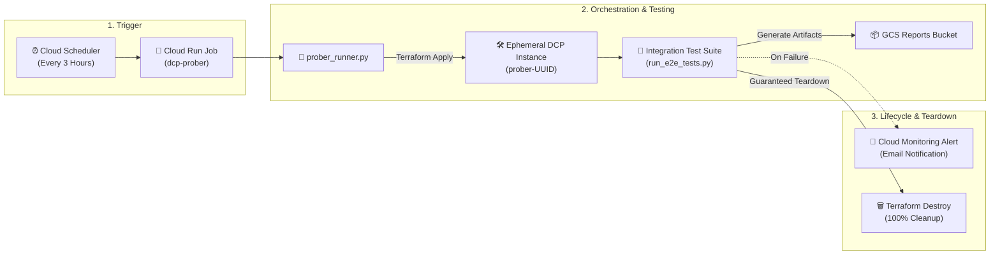

# Data Commons Platform (DCP) — Serverless Ephemeral Prober

An automated, serverless integration prober for the **Data Commons Platform (DCP)**.

The prober continuously provisions an isolated ephemeral DCP instance on GCP via Terraform, executes the full end-to-end integration test suite, uploads machine-readable execution reports to GCS, triggers Cloud Monitoring alerts on failure, and guarantees 100% infrastructure teardown.

---

## 🏗️ Architecture Overview



### Key Capabilities
- **State & Environment Isolation**: Uses unique execution prefixes (`ephemeral/prober-{uuid}/default.tfstate`) in a single state bucket and strictly scopes GCP environment variables to prevent local/inherited quota leakage.
- **Guaranteed Teardown**: Python `try ... finally` blocks and `SIGTERM`/`SIGINT` signal handlers guarantee that `terraform destroy -auto-approve` executes on test failure, uncaught exception, or container cancellation.
- **Structured Cloud Logging & Instant Alerts**: Emits single-line structured JSON logs (`jsonPayload`) for Cloud Logging, triggering dual-condition Cloud Monitoring email alerts instantly (`0s` evaluation duration) on any test or job failure.
- **Full Platform Lifecycle Coverage**: Tests the entire live stack in sequence — Terraform Provisioning $\to$ Ingestion Dataflows $\to$ SVG Hierarchy & Embeddings $\to$ REST & SDMX 3.0 APIs $\to$ MCP Agents $\to$ 100% Teardown.

### ⚙️ How It Works (End-to-End Flow)
1. **One-Time Prober Deployment & Scheduling**:
   * The prober engine (Cloud Run Job + Cloud Scheduler cron + Cloud Monitoring alert policy) is provisioned once via [`tests/integration/prober/deploy/deploy_prober.sh`](deploy/deploy_prober.sh) and runs on a recurring schedule (default: every 3 hours).

2. **At Each Scheduled Run**:
   Cloud Scheduler triggers the Cloud Run Job, which executes [`tests/integration/prober/prober_runner.py`](prober_runner.py) to perform the full lifecycle:
   * **Scaffold Ephemeral Workspace**: Scaffolds an isolated temporary workspace (`/tmp/prober-<uuid>`) via `datacommons admin init --tf-git-ref main` with a dedicated remote state prefix (`ephemeral/prober-<uuid>`) and runtime variable overrides.
   * **Provision Fresh Infrastructure**: Runs `terraform apply` (with automatic retry backoff for transient GCP rate limits) to spin up a completely isolated DCP stack on GCP (Spanner DB, Redis, Cloud Run services, Workflows).
   * **Install CLI & Execute E2E Tests**: Fetches the latest `datacommons` monorepo packages (`client`, `admin`, `cli`) from GitHub `main` and runs the integration test suite ([`tests/integration/run_e2e_tests.py`](../run_e2e_tests.py) with `foobar_wages`) across Ingestion $\to$ Postprocessing (SVG/Embeddings) $\to$ Serving APIs $\to$ MCP Agent tools.
   * **Guaranteed 100% Teardown**: Wraps execution in `try ... finally` and signal handlers (`SIGTERM`/`SIGINT`) to ensure `terraform destroy -auto-approve` runs immediately after testing, leaving zero orphaned GCP resources.
   * **Report & Alert**: Publishes structured JSON reports to GCS and outputs single-line structured JSON logs (`PROBER_EXECUTION_SUMMARY`). Cloud Monitoring evaluates this instantly to fire an email notification on any failure.

> ℹ️ **Note on [`cleanup_prober_trash.py`](tools/cleanup_prober_trash.py)**: This janitor tool is **not** part of the automated prober flow. It is strictly an operational/developer tool to inspect and clean up resources left behind during local debugging with `--skip-destroy` or after ungraceful manual cancellations.

---

## ⚙️ Deployment & Continuous Delivery
 
* **🤖 Automated CI/CD (Tests & Image)**: When code or test manifests change under `tests/integration/**` on `main`, Cloud Build automatically builds a fresh container image and deploys it to the `dcp-prober` Cloud Run Job. No manual action is required.
* **🛠️ Manual Infrastructure Deployment (Terraform)**: If you modify the underlying Terraform infrastructure blueprint ([`deploy/terraform/`](deploy/terraform/)), such as IAM policies, alert notification channels, or cron schedules, execute [`deploy/deploy_prober.sh`](deploy/deploy_prober.sh). The script automatically reuses existing secrets and settings from Google Secret Manager.
* **Runbook**: For full deployment parameters and setup details, see the **[Prober Deployment Runbook](deploy/README.md)**.

---

## ☁️ Deployed Cloud Infrastructure & Resource Links

Prober infrastructure and cron schedules are deployed via Terraform with **Remote State Management** stored in Google Cloud Storage:

* **Cloud Run Job**: [Cloud Run Job: `dcp-prober`](https://console.cloud.google.com/run/jobs/details/us-central1/dcp-prober/executions?project=datcom-dcp)
* **Cloud Scheduler Trigger**: [Cloud Scheduler Job: `dcp-prober-cron`](https://console.cloud.google.com/cloudscheduler/jobs/edit/us-central1/dcp-prober-cron?project=datcom-dcp)
* **Active Integration Test Config**: [`foobar_wages`](https://github.com/datacommonsorg/datacommons/blob/main/tests/integration/test_data/foobar_wages/test_spec.yaml) (exercises 1,242 observations, SVG hierarchy, Vertex AI natural language embeddings, REST/SDMX 3.0 APIs, and MCP tools)
* **Terraform Remote State Bucket**: [`gs://tf-state-dcp-prober-datcom-dcp`](https://console.cloud.google.com/storage/browser/tf-state-dcp-prober-datcom-dcp?project=datcom-dcp)
* **Container Image in Artifact Registry**: [`us-docker.pkg.dev/datcom-ci/datcom-tools/datacommons-platform-prober:latest`](https://console.cloud.google.com/artifacts/docker/datcom-ci/us/datcom-tools/datacommons-platform-prober?project=datcom-ci)
* **Prober Data Commons API Key**: [Secret Manager: `dcp-prober-api-key`](https://console.cloud.google.com/security/secret-manager/secret/dcp-prober-api-key/versions?project=datcom-dcp)

---

## 🧪 Running Prober Runner Locally / Debugging

### Run Full Ephemeral Cycle Locally
```bash
uv run python tests/integration/prober/prober_runner.py \
    --project datcom-dcp \
    --test-config foobar_wages
```

### Retain Ephemeral Resources for Debugging (`--skip-destroy`)
To keep all provisioned GCP resources (Cloud Workflows, Cloud Run services, Spanner databases, logs) alive after test execution for manual inspection:

```bash
uv run python tests/integration/prober/prober_runner.py \
    --project datcom-dcp \
    --test-config foobar_wages \
    --skip-destroy
```

---

## 🧹 Interactive Resource Cleanup Tool

If a debugging session with `--skip-destroy` or an unexpected cancellation leaves temporary `prober-*` resources behind, run the interactive cleanup janitor:

```bash
uv run python tests/integration/prober/tools/cleanup_prober_trash.py
```

This tool safely scans and prompts before removing any orphaned `prober-*` Spanner instances, Cloud Run services, buckets, IAM bindings, or API keys.
